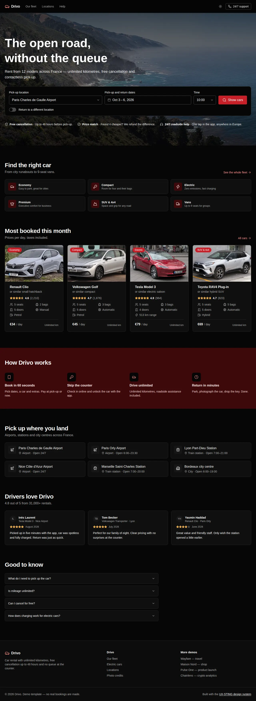
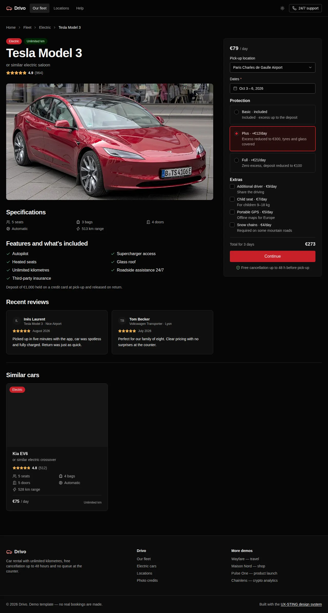
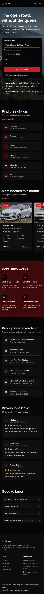

# Drivo — car rental template

A car-rental site built with UX-STING: pick-up search, a fleet page with filters, sorting and pagination, car details with protection plans and extras priced live, and a two-step checkout. Drivo is fictional; the cars are real models photographed on Wikimedia Commons (credited on `/credits`).

```bash
pnpm --filter @ux-sting/example-car-rental dev
```

- Brand theme: `app/providers.tsx` (orange on slate).
- Fleet, locations, extras and protection plans: `lib/data.ts`.
- Live demo: https://ssassam.github.io/UX-STING/cars/

## Screenshots

  

