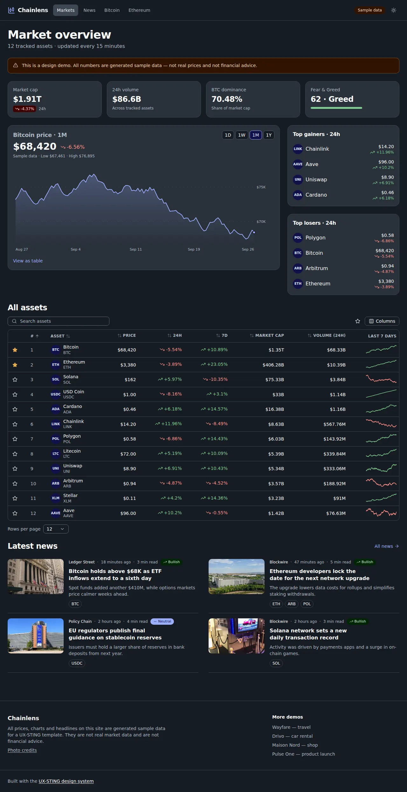
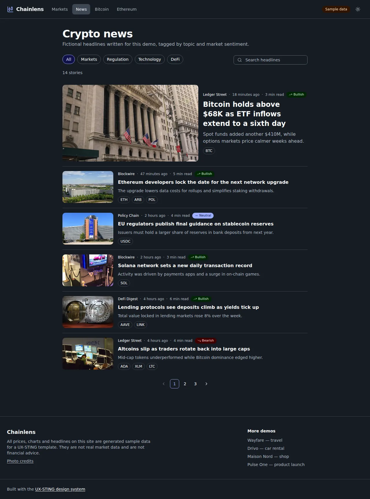
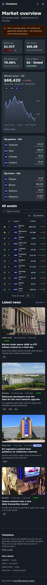

# Chainlens — crypto analytics and news template

A market dashboard built with UX-STING: summary stat cards, an interactive price chart (hover or arrow keys, with a table view), top movers, a sortable and searchable asset table with sparklines and a watchlist, coin pages and a news feed with topics and sentiment. Dark mode and compact density by default.

**All prices, charts and headlines are generated sample data** (seeded in `lib/market.ts` and `lib/news.ts`). They are not real market data and not financial advice.

```bash
pnpm --filter @ux-sting/example-crypto dev
```

- Chart: `components/price-chart.tsx` (dependency-free SVG).
- Live demo: https://ssassam.github.io/UX-STING/crypto/

## Screenshots

  

