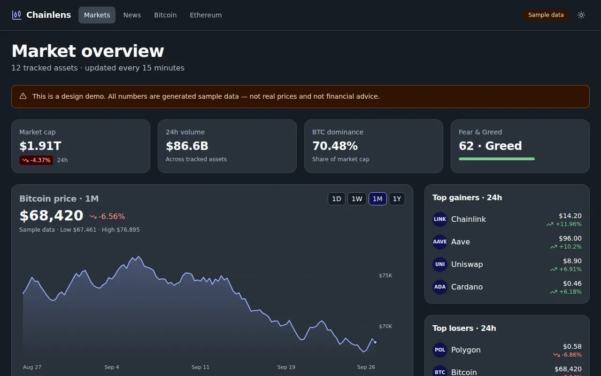
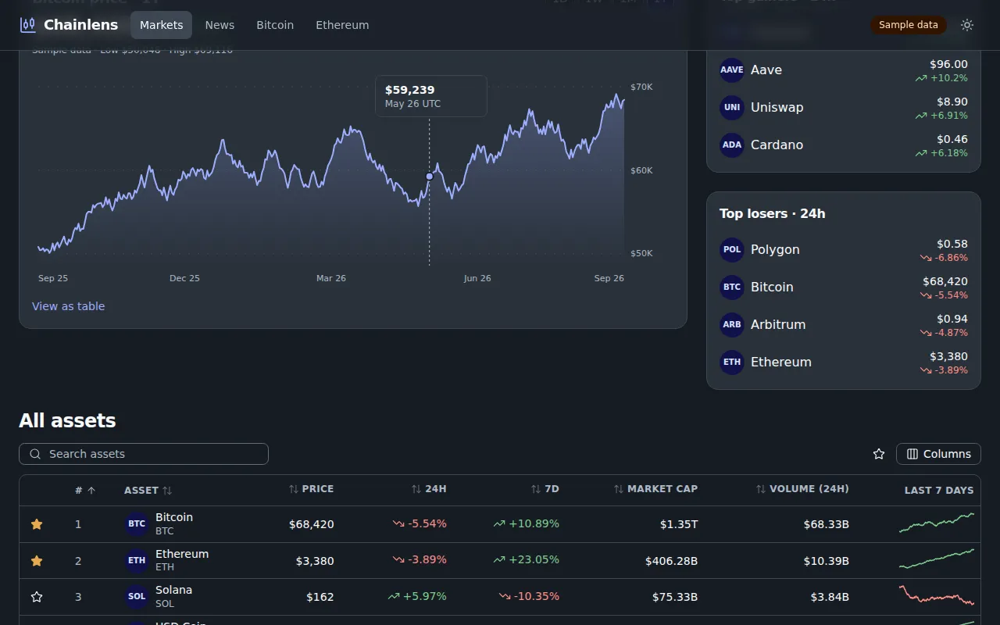
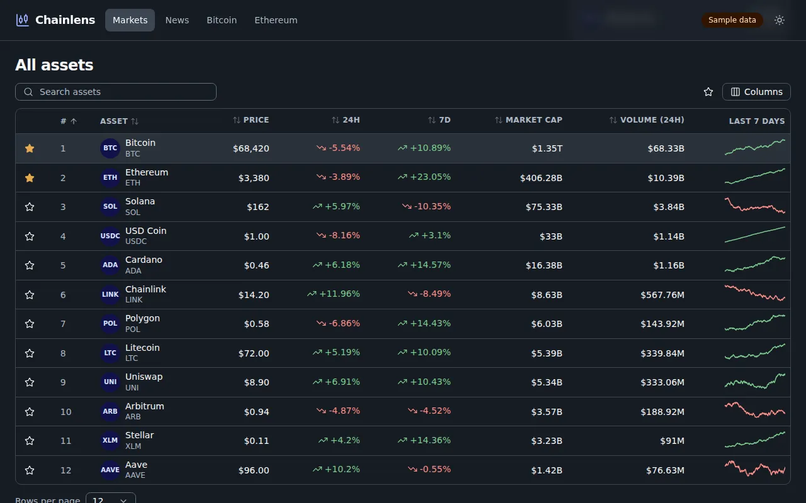
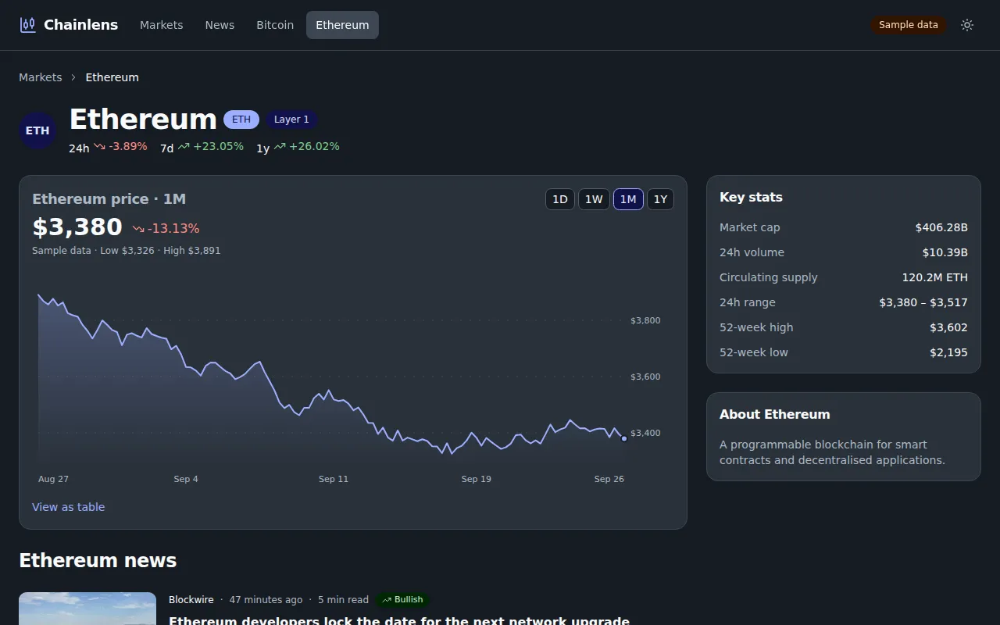
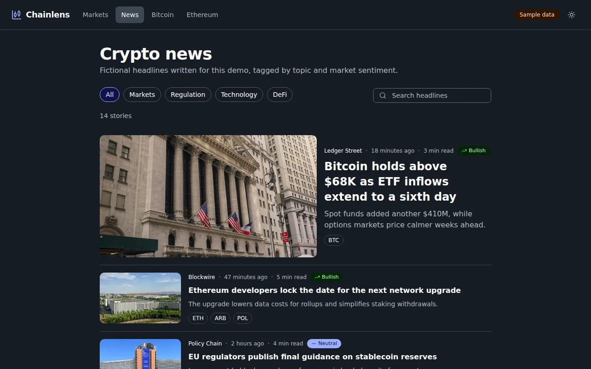
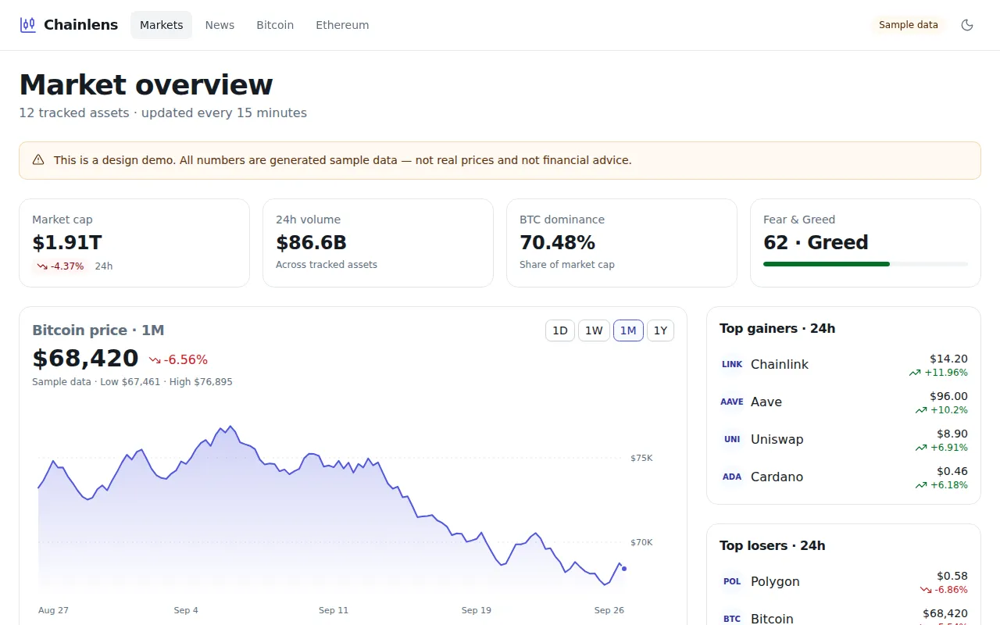

# Chainlens — crypto analytics and news template

A market dashboard built with UX-STING: summary stat cards, an interactive price chart (hover or arrow keys, with a table view), top movers, a sortable and searchable asset table with sparklines and a watchlist, coin pages and a news feed with topics and sentiment. Dark mode and compact density by default.

**All prices, charts and headlines are generated sample data** (seeded in `lib/market.ts` and `lib/news.ts`). They are not real market data and not financial advice.

```bash
pnpm --filter @ux-sting/example-crypto dev
```

- Chart: `components/price-chart.tsx` (dependency-free SVG).
- Live demo: https://ssassam.github.io/UX-STING/crypto/

## Screenshots

<table>
<tr><td width="50%" align="center"><a href="screenshots/1-markets.webp"></a><br><sub>Market overview</sub></td><td width="50%" align="center"><a href="screenshots/2-chart.webp"></a><br><sub>Interactive price chart</sub></td></tr>
<tr><td width="50%" align="center"><a href="screenshots/3-assets.webp"></a><br><sub>Sortable asset table</sub></td><td width="50%" align="center"><a href="screenshots/4-coin.webp"></a><br><sub>Coin page</sub></td></tr>
<tr><td width="50%" align="center"><a href="screenshots/5-news.webp"></a><br><sub>News with images</sub></td><td width="50%" align="center"><a href="screenshots/6-light-mode.webp"></a><br><sub>Light mode</sub></td></tr>
</table>

