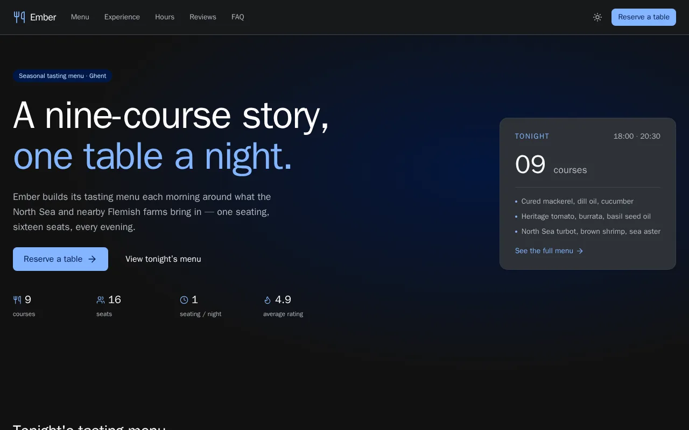
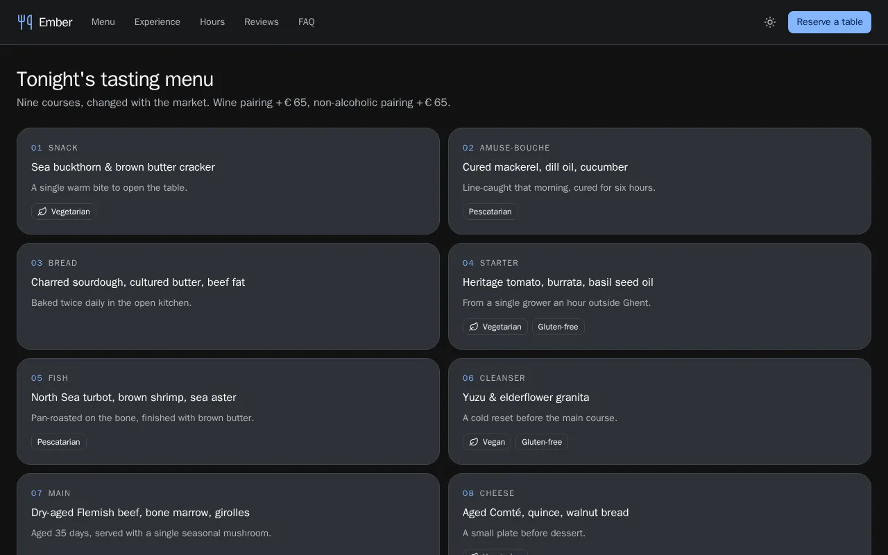
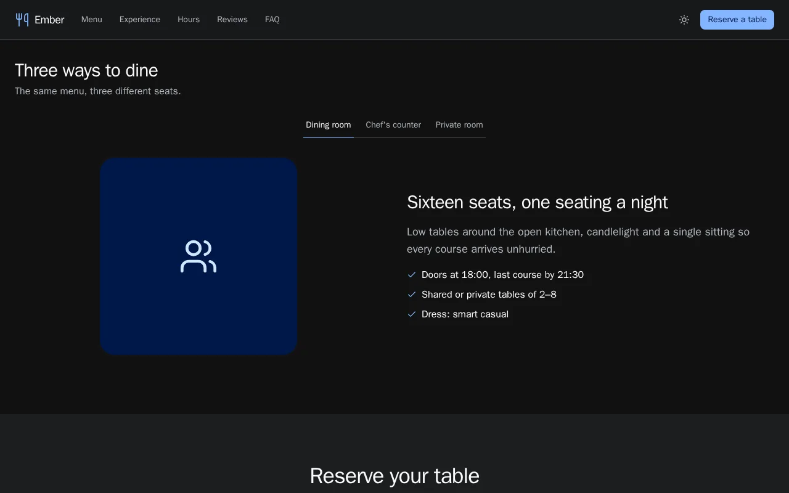
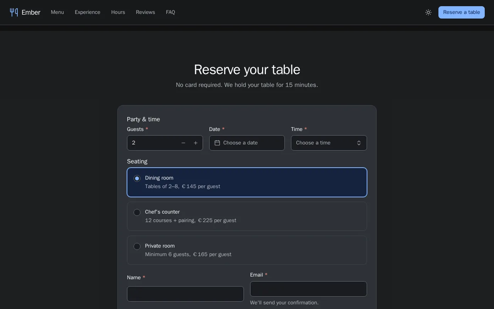
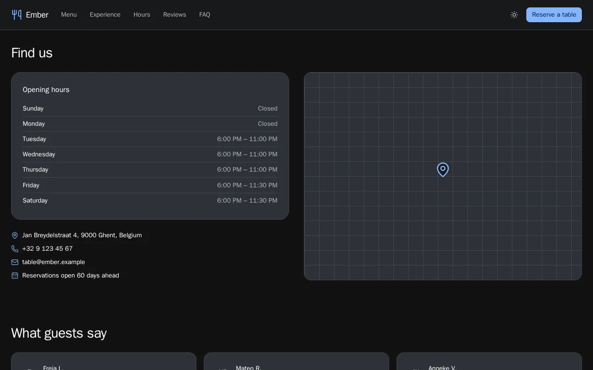
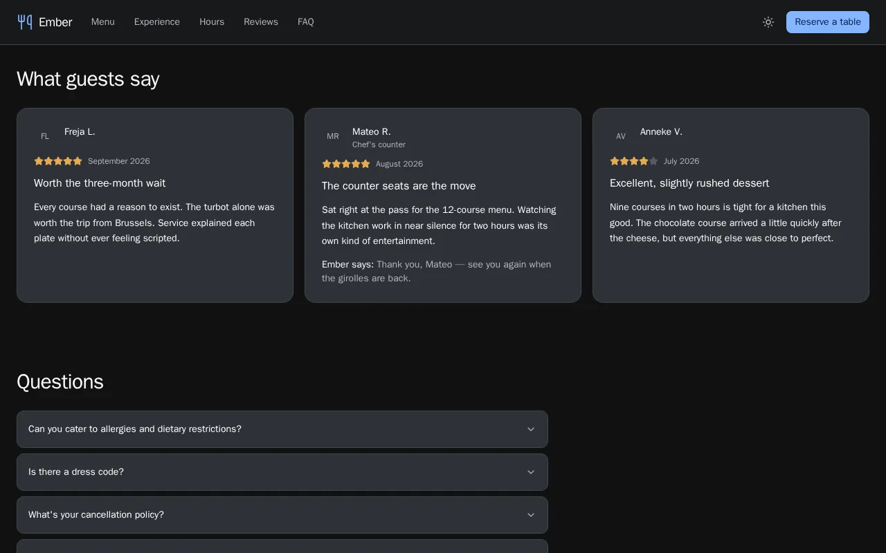

# Ember — restaurant reservation template

A tasting-menu restaurant site built with UX-STING: hero with a live menu preview card, a nine-course tasting menu with dietary tags, a tabbed dining-experience section, a full reservation form (date, time, party size, seating), opening hours with a live open/closed status, a map placeholder, guest reviews and FAQ. Dark mode by default.

```bash
pnpm --filter @ux-sting/example-ember dev
```

- Reservation form: `components/reservation.tsx`.
- Dining-experience tabs: `components/experience.tsx`.
- Live demo: https://ssassam.github.io/UX-STING/ember/

## Screenshots

<table>
<tr><td width="50%" align="center"><a href="screenshots/1-hero.webp"></a><br><sub>Hero with tonight's menu preview</sub></td><td width="50%" align="center"><a href="screenshots/2-menu.webp"></a><br><sub>Tasting menu with dietary tags</sub></td></tr>
<tr><td width="50%" align="center"><a href="screenshots/3-experience.webp"></a><br><sub>Dining-experience tabs</sub></td><td width="50%" align="center"><a href="screenshots/4-reserve.webp"></a><br><sub>Reservation form</sub></td></tr>
<tr><td width="50%" align="center"><a href="screenshots/5-hours.webp"></a><br><sub>Opening hours and map</sub></td><td width="50%" align="center"><a href="screenshots/6-reviews.webp"></a><br><sub>Reviews and FAQ</sub></td></tr>
</table>
