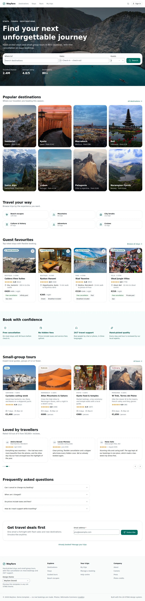
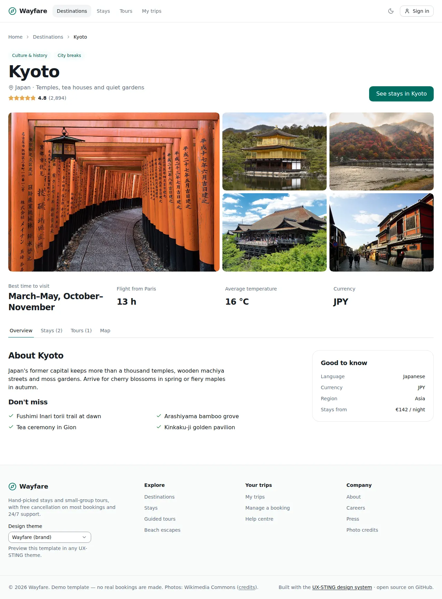
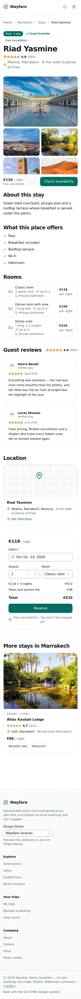

# Wayfare — travel booking template

A complete travel website built only with the UX-STING design system: destinations, hotel search, stay and tour detail pages, a three-step checkout and a "My trips" area. Wayfare is a fictional brand, and no real bookings are made.

```bash
pnpm install
pnpm --filter @ux-sting/example-travel dev   # http://localhost:3000
```

## Screenshots

| Home (desktop) | Destination (desktop) | Stay (phone) |
| --- | --- | --- |
|  |  |  |

## Pages

| Route | What it shows | Key components |
| --- | --- | --- |
| `/` | Hero search, popular destinations, trip styles, featured stays, tours, reviews, FAQ, newsletter | `Autocomplete`, `DateRangePicker`, `NumberInput`, `CityCard`, `CategoryCard`, `HotelCard`, `Carousel`, `ReviewCard`, `Accordion`, `Form` |
| `/destinations` | Destinations filtered by trip style and region | `Chip`, `NativeSelect`, `EmptyState` |
| `/destinations/[slug]` | Gallery, key facts, and Overview / Stays / Tours / Map tabs | `ImageGallery`, `StatGroup`, `Tabs`, `MapPlaceholder` |
| `/search` | Stay search with filters, sorting, list / grid / map views and pagination | `FilterPanel`, `RangeSlider`, `CheckboxGroup`, `RadioGroup`, `Switch`, `FilterChips`, `MapPanel`, `Pagination` |
| `/stays/[id]` | Stay detail: rooms, amenities, reviews, location, a booking card with a live price breakdown, and a sticky mobile reserve bar | `List`, `LocationCard`, `DateRangePicker`, `Price`, `Currency` |
| `/tours`, `/tours/[id]` | Tour listing and detail with itinerary and departure picker | `Timeline`, `RadioCard`, `Stat` |
| `/checkout` | Details → Extras → Payment, with accessible validation and a confirmation screen | `Stepper`, `Form`, `Field`, `FormErrorSummary`, `Checkbox`, `SuccessState` |
| `/trips` | Upcoming, past and saved trips | `Tabs`, `Badge`, `Progress`, `EmptyState` |
| `/credits` | Author and license for every photo | `Link` |

## Make it yours

- **Brand:** edit `wayfareTheme` in `app/providers.tsx` (primary palette, neutrals, radius, fonts), or pass any preset name.
- **Theme preview:** the footer's *Design theme* menu switches the whole site between the Wayfare theme and all built-in presets (Material, Fluent, Carbon, Polaris, Apple, Base Web, Stripe styles and more). Delete it for production.
- **Content:** everything lives in `lib/data.ts`. Replace it with your CMS or booking API; pages only read typed `Destination`, `Stay` and `Tour` objects.
- **Photos:** real photos of each place from Wikimedia Commons, listed in `lib/photos.ts` with author and license, and credited on `/credits` as their CC licenses require. Keep the credits if you reuse them, or swap in your own photos. `Image` and the cards show a neutral placeholder if a photo fails to load.

## Live demo on GitHub Pages

`.github/workflows/pages.yml` exports this site as static files and deploys it on every push. Turn it on once in the repository: **Settings → Pages → Build and deployment → Source: GitHub Actions**. The site is then served at `https://<owner>.github.io/<repo>/`.

To try the static export locally:

```bash
PAGES_BASE_PATH=/UX-STING pnpm --filter @ux-sting/example-travel build   # output in examples/travel/out
```

## Quality

Every page passes the repository's browser audit (axe checks including colour contrast, and no horizontal overflow) at 390 px and 1280 px, in light and dark mode:

```bash
pnpm --filter @ux-sting/example-travel build
(cd examples/travel && npx next start -p 3200 &)
node scripts/browser-audit.ts http://localhost:3200 / /search /stays/riad-yasmine /checkout /trips
```
