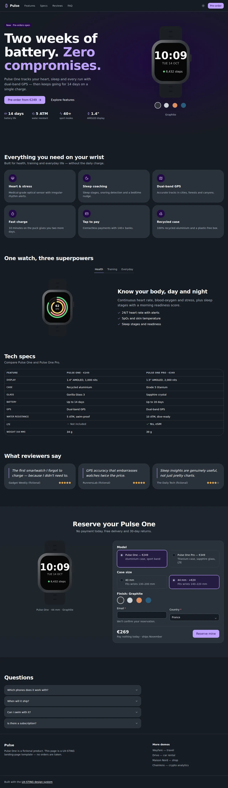
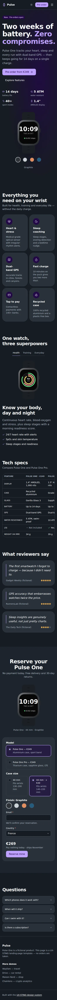

# Pulse One — product landing page template

A launch page for a fictional smartwatch, built with UX-STING: hero with a finish picker that recolours the SVG product illustration, feature grid, tabbed feature showcase, a specs comparison table, press quotes, a pre-order configurator and FAQ. Dark mode by default.

```bash
pnpm --filter @ux-sting/example-watch dev
```

- Product illustration and finishes: `components/watch-art.tsx`.
- Pre-order configurator: `components/preorder.tsx`.
- Live demo: https://ssassam.github.io/UX-STING/watch/

## Screenshots

 

